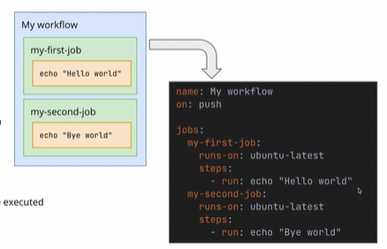

# gh-actions-course
github action repository wherein i will be walking you through github

# gh-actions-course
github action repository wherein i will be walking you through github

gh actions:-> the feature as offered by github includes :
1.workflows
2.jobs
3.steps
it is a CI/CD pipeline solution provided by github
->workflows: edfined at teh repo level. so this has to be defined at the repo level.
->define the trigger which actually start the workflow
-> workflows are composed of one or more jobs inside them jobs 
jobs: 
-> these are defined at the work flow(they cannot be outside the env) and they also define at which os or env they run.
-> jobs may consists of one or more steps. note that if there is no dependency stated between the jobs then they run parallely

steps:
-> they are defined at teh job level
-> they define the actual scripts or the github actions that will be executed.
-> here we can have the github actions taken from other repository or taken it from teh market place.
-> steps will always run sequentially by default. if we want them to run parralley then add them to separate jobs

basic workflow:

name: my workflow
on: push  -> indicates the trigger

jobs:
    my-first-job:
        runs-on: ubuntu-latest
        steps:
            - run: echo "hello world"
    my-second-job:
        runs-on: ubuntu-latest
        steps:
            - run: echo "bye world"

here we have 2 jobs:my-second-job, my-first-job
note that the jobs will not use the same virtual machoine it may run on different virtual machine

workflow events:
->events can be considered as triggering
-> triggering workflows can be done in many ways in github workflows
1. repository events:
->  like push pull. so this workflow will be triggered on push or pull made to the repository
->  issues: triggered by a variety of events related to issues.
-> pull_request: triggered by a variety of events related to PRs
-> pull_request_review: triggered by a variety of events related to PR reviews(submitting, editting, deleting)
-> fork: triggered when your repository is forked

# the events can be given as an array or an object
# eg: array case
# on:
# - push
# - pull
# eg: object
# on :
#     push:
#     pull_request: for different branch we can have different events this way

2.manual trigger:
-> triggered via the UI: triggered from the actions tab in github
-> triggered via an API call: triggered via github REST API
-> Triggered from another workflow: Triggered from within another workflow

3. schedule: run the workflow a s a chron job
github events
refer this to generate a cron job expression
refer for events: https://docs.github.com/en/actions/reference/events-that-trigger-workflows?apiVersion=2022-11-28&versionId=free-pro-team%40latest&category=actions&subcategory=workflows#push

